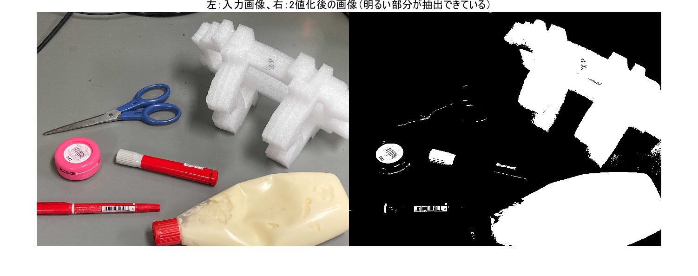
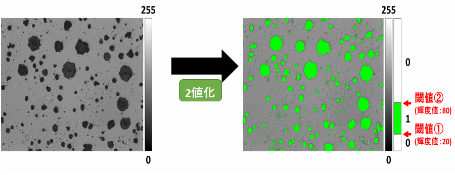
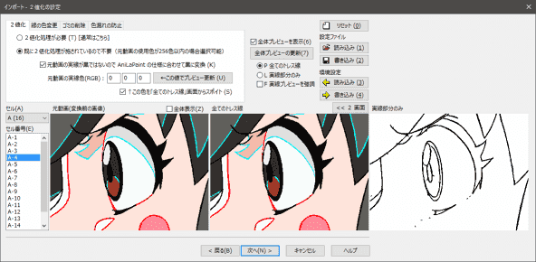
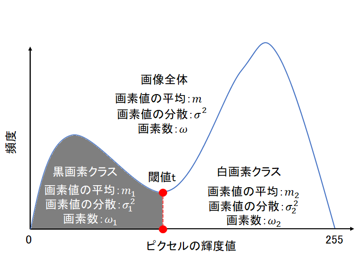
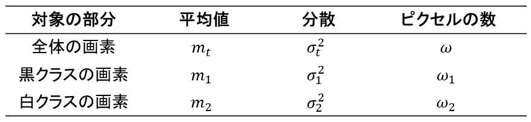

## このページは[こちらの記事](https://kentapt.hatenablog.com/entry/2022/02/23/122306)の本文のファイルやコードをアップロードしています。よろしければぜひご覧ください。  
  
<br>  
  
- [1 はじめに](#1-はじめに)
- [2 2値化の方法について](#2-2値化の方法について)
  - [2-1 2値化の方法のイメージ](#2-1-2値化の方法のイメージ)
  - [2-2 クラス内の分散について](#2-2-クラス内の分散について)
  - [2-3 クラス間の分散について](#2-3-クラス間の分散について)
  - [2-4 全分散について](#2-4-全分散について)
    - [2-4-1 全分散＝クラス内分散＋クラス間分散？](#2-4-1-全分散＝クラス内分散＋クラス間分散？)
  - [2-5 閾値の決定について](#2-5-閾値の決定について)
- [3 まとめ](#3-まとめ)
- [参考文献](#参考文献)  


# 画像の2値化の方法を数式から理解したい
# 1 はじめに

この記事では、画像を対象として、**2値化処理**（2値化とする）の方法を説明します。メインパートでは、丁寧に式展開をしながら2値化の方法（判別分析法）の説明を行いました。もし何か間違いがございましたら教えていただけますと幸いです。

　なお、この記事は、[デジタル画像処理](https://www.amazon.co.jp/%E3%83%87%E3%82%A3%E3%82%B8%E3%82%BF%E3%83%AB%E7%94%BB%E5%83%8F%E5%87%A6%E7%90%86-%E6%94%B9%E8%A8%82%E7%AC%AC%E4%BA%8C%E7%89%88-%E3%83%87%E3%82%A3%E3%82%B8%E3%82%BF%E3%83%AB%E7%94%BB%E5%83%8F%E5%87%A6%E7%90%86%E7%B7%A8%E9%9B%86%E5%A7%94%E5%93%A1%E4%BC%9A-ebook/dp/B085L18YXF)の2値化のページを参考にしていて、そのページを詳しく書いたような構成になっています。2値化をベースにしたさらなる応用例などはデジタル画像処理に記載があります。

　早速ですが、以下の画像を見てください。

左の画像は入力画像で、右側が明るいピクセルを白、暗いピクセルを黒で示しています。2値化により、自動的に明るい/暗いピクセルに分けています。この2値化の処理を行うことで、画像に映る対象を自動的に取得したり、画像を大きく分割するといったことができます。

```matlab:Code
I = imread('demo_img\img2.jpg');
I_gray = rgb2gray(I); %グレースケールに変換
BW = imbinarize(I_gray,'global'); % global:大津の2値化
figure;imshowpair(I,BW,'montage');title('左：入力画像、右：2値化後の画像（明るい部分が抽出できている）',"FontSize",14)
```



図１：2値化を行ったときの例。左が入力画像で、右が2値化を行った後の結果を示す。2値化を行ったことで、明るいピクセルと暗いピクセルを分けることができていることがわかる。

  

ほかの利用例として、以下の図２を見てください。こちらは、ミブログさまの記事より引用しています。ここでは、顕微鏡画像のようなものから対象のピクセルを取り出しています。例えば、観察したい細胞のエリアのみを自動的に取り出すということもできるかもしれません。



図２：顕微鏡画像のようなものを対象にした2値化の例

画像出典：**ミブログさま（2値化 - 画像解析の基本処理、対象を検出する）**

https://www.mitani-visual.jp/mivlog/imageprocessing/bin03857.php

  

また、もう一つの例として、以下の図3を見てください。こちらは***AniLaSoft***さまのページより引用しています。これは、2値化のほかにも処理を行っていますが、処理の一部として2値化を利用することで、右下のようなスケッチを得ることができています。



画像出典：***AniLaSoftさま（***２値化 操作手順）

https://anilasoft.jp/help/anilapaint-1-5/import/digitalize/mode/usage.htm

  

このように、2値化は画像処理の基本的な技術として多くの分野で活用されています。次の章から具体的にどのような処理を行っているか説明したいと思います。

# 2 2値化の方法について
## 2-1 2値化の方法のイメージ

以下の図4に示すヒストグラムは、2値化の方法のイメージを示しています。対象は対象の画像（または、対象とするエリア）の画素（ピクセル）です。横軸は画素の値、縦軸はその値が何度現れたか（頻度）を示しています。画像の中の画素を見たときに、暗い部分と明るい部分があれば、以下のような2つのピークを観測することができます。今回紹介する2値化の方法では、この2つのピークを「いい感じに」分割する閾値tを探し、そこで明るい/暗いエリアに分割します。それぞれのクラスをそれぞれ、白画素クラス、および、黒画素クラスと呼ぶことにします。次の節で、具体的にどのように計算するかを説明します。



　図4：2値化の方法のイメージ

  

始めに、以下の表1に、本記事で扱う変数についてまとめています。画像全体の画素の平均をとし、分散を、そして、画像全体のピクセルの数をとします。また、2値化を行ったあとの、黒画素のクラス/白画素のクラスについても同様に変数を設けます。それに関しては、表の中段及び下段をご覧ください。

表1：本記事で主に用いる変数について



  

2値化の結果がどのような場合に、「いい感じ」であるかを考えます。まず、**黒画素クラスと白画素クラスでは、その両者のクラス間で、画素値ができるだけ離れているとよい**です。画像中の暗い部分と明るい部分を分けることができていれば、それらの差は大きくなると考えられます。

　また、それぞれのクラス内ではどうでしょうか。**同じクラス内では、その輝度値が似ているので、その輝度の違いは小さいはず**です。そのクラス間およびクラス内で輝度値がどれほど変動しているかを示す指標として、分散が考えられます。そこで、クラス内とクラス間のそれぞれで、分散の値を考えていきたいと思います。

## 2-2 クラス内の分散について

クラス内の分散についてですが、黒画素クラスおよび白画素クラスの分散は、表1に示した通りです。これらの値は黒画素クラスと白画素クラスを分ける閾値tが決まれば、一意に定まる値です。クラス内分散を以下のように定義します。と$\sigma_2^2$は、それぞれ黒画素クラスと白画素クラスの分散なので、以下の式(1)は、それぞれの分散をピクセル数による重みつき平均を求めていることになります。例えば、黒画素クラスに属する画素数が画像中の画素数の90%、そして、白画素クラスに属する画素数が画像中の画素数の10%である場合は、黒画素クラスと白画素クラスの分散を9:1の割合で重みづけをして平均を取っていることになります。

 ...(1)

この式(1)の第一項と第二項を足し算して、式(2)としてます。

 ...(2)

## 2-3 クラス間の分散について

次に、クラス間の分散を考えます。クラス間の分散を式(3)のように定義します。各クラスの画素の平均値から画像全体の輝度値の平均を引いて、2乗をしています。ここでもクラス内分散と同様に、黒画素クラスと白画素クラスの画素数によって重みづけをしています。黒画素クラスと白画素クラスの平均が全体から離れるほど、以下の式(3)の値は大きくなります。逆に黒画素クラスと白画素クラスの画素の平均値がそれぞれ画像全体の画素値の平均と同じ（つまり黒と白を分けられてない）場合は、このクラス間の分散の値は0になります。先述したように、この値は大きくなることが望ましいです。

 ...(3)

ここで、画像全体の輝度値の平均は式(4)によっても表すことができます。輝度値の平均は各画素の値を足して平均をすることで計算ができますが、黒画素クラスと白画素クラスの平均にそれぞれのピクセル数を掛け算して、すべての画素の数で割り算しても求めることができます。

 ...(4)

この式(4)のの値を、式(3)に代入し、整理していきます。式(3)は以下のようになります。

 ...(5)

1つ目の括弧の中のの分母と分子にをかけて、

 ...(6)

分子の値を計算し、さらに分母のを括弧の外に出して、

 ...(7)

第一項、第二項からそれぞれ、とを括弧の外に出して、

 ...(8)

が共通するため、

 ...(9)

であり、でも括ることができて、

 ...(10)

となる。分母と分子のを打ち消して、以下の式(11)を得る。

 ...(11)

## 2-4 全分散について

また、画像の全分散とクラス内分散・クラス間分散は以下の式(12)の関係があります。

 ...(12)

ここで、2値化の方法の結論の前に、なぜ式(12)が成り立つのかを考えたいと思います。ただ、ひとまず式(12)が成り立つとして、実際にどのように2値化が行わているか先に知りたい場合は、2-5章をご覧ください。

### 2-4-1 全分散＝クラス内分散＋クラス間分散？

全分散は、画像の各画素をサンプルとしたときの分散の値と等しいです。そのため、画素中の画素値をなどとすると、全分散は以下の式(13)で計算することができます。

 ...(13)

ここで、などの、画素値に関してですが、2値化を行ったあとに、それぞれ、黒画素クラス/白画素クラスに分かれます。式(13)の各画素の値を2値化後の結果で置き換えます。つまり、などの、画素値を、や$w_k$（それぞれ黒と白画素クラスに相当）とすると、

 ...(14)

と表すことができます。

**この値が、式(2)のクラス内分散と式(4)のクラス間分散の和と等しければ、全分散＝クラス内分散＋クラス間分散である**ことがわかります。

ここで、式(2), (4), (14)ともに、分母の値がであるので、分母の値は無視して考えます。

まず、黒画素クラスに分類されたピクセルに対して考えます。

分散の定義から

 ...(15)

となります。両辺にを掛けて、

 ...(16)

を得ます。

（クラス内分散）＋（クラス間分散）とすると（ただし分母の値は無視する）、

$\omega_1 \sigma_1^2 ++\omega_1 {{\left(m_1 -m_t \right)}}^2$ ...(17)

 ...(18)

また、二項目に関しては、以下のように、書き換えます。

 ...(19)

一方、

（全分散）とすると、

 ...(20)

となります。

ここで、を計算して、であれば、全分散＝クラス内分散＋クラス間分散であることがわかります。

 ...(21)

を省略して展開すると、

 ...(22)

(22)を整理して、を省略せずにまとめると、

 ...(23)

 ...(24)

に関して、黒画素クラスの平均×（黒画素クラスのピクセル数）の値と、黒画素クラスの輝度値の総和は等しいので、ゼロになる。つまり、式(24)の値は

となる。

よって、

 ...(25)

となり、、つまり、全分散＝クラス内分散＋クラス間分散であることがわかる。

## 2-5 閾値の決定について

ここで、クラス内分散とクラス間分散について考えます。

   -  **クラス内分散：小さいほうが良い（黒画素・白画素クラスでは、同じクラス内では似た画素値があればよい）** 
   -  **クラス間分散：大きいほうが良い（黒画素・白画素クラス間で、その画素値が、より異なっているほうがよい）** 

よって、クラス間分散÷クラス内分散である、 ...(26)

を考え、この値が大きいほど、2値化においては望ましいことになります。またこの値のことを分離度と呼びます。

前節で確認したように、の関係を利用すると、分離度は、

 ...(27)


となります。全分散であるは、2値化に用いる閾値に関わらず一定であり、クラス内分散が最小になるように閾値tを求めればよいことがわかります。

# 3 まとめ

   -  この記事では、画像を2値化するための方法（判別分析法）を紹介しました。 
   -  クラス内分散やクラス間分散を求め、最終的に分離度が最大になるように閾値tを決めればよいことがわかりました。 
   -  この方法では、閾値を自分で決める必要がない点で非常に有用です。 

# 参考文献

[ディジタル画像処理編集委員会](https://www.amazon.co.jp/s/ref=dp_byline_sr_ebooks_1?ie=UTF8&field-author=%E3%83%87%E3%82%A3%E3%82%B8%E3%82%BF%E3%83%AB%E7%94%BB%E5%83%8F%E5%87%A6%E7%90%86%E7%B7%A8%E9%9B%86%E5%A7%94%E5%93%A1%E4%BC%9A&text=%E3%83%87%E3%82%A3%E3%82%B8%E3%82%BF%E3%83%AB%E7%94%BB%E5%83%8F%E5%87%A6%E7%90%86%E7%B7%A8%E9%9B%86%E5%A7%94%E5%93%A1%E4%BC%9A&sort=relevancerank&search-alias=digital-text)：デジタル画像処理（[リンク](https://www.amazon.co.jp/%E3%83%87%E3%82%A3%E3%82%B8%E3%82%BF%E3%83%AB%E7%94%BB%E5%83%8F%E5%87%A6%E7%90%86-%E6%94%B9%E8%A8%82%E7%AC%AC%E4%BA%8C%E7%89%88-%E3%83%87%E3%82%A3%E3%82%B8%E3%82%BF%E3%83%AB%E7%94%BB%E5%83%8F%E5%87%A6%E7%90%86%E7%B7%A8%E9%9B%86%E5%A7%94%E5%93%A1%E4%BC%9A-ebook/dp/B085L18YXF)）
