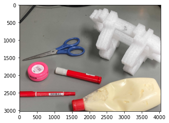
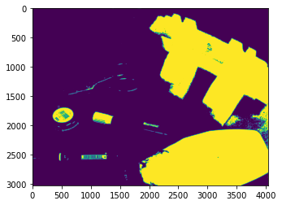

# 二値化による画像処理  
ブログ中で例示した2値化処理を行うpythonコードです。


```python
import cv2 #画像処理で用いる
import matplotlib.pyplot as plt # プロットのために用いる
import numpy as np 
%matplotlib inline 

im = cv2.imread('demo_img/img2.jpg')
im = cv2.cvtColor(im, cv2.COLOR_BGR2RGB)
#表示
plt.imshow(im)
```


    <matplotlib.image.AxesImage at 0x21446a93cd0>


    

    


```python
im_gray = cv2.cvtColor(im, cv2.COLOR_BGR2GRAY)
th, bw = cv2.threshold(im_gray, 0, 255, cv2.THRESH_OTSU)
#画像の確認
plt.imshow(bw)
#閾値がいくつになったか確認
print("閾値: {}".format(th))
```

    閾値: 160.0
    


    

    


```python

```
